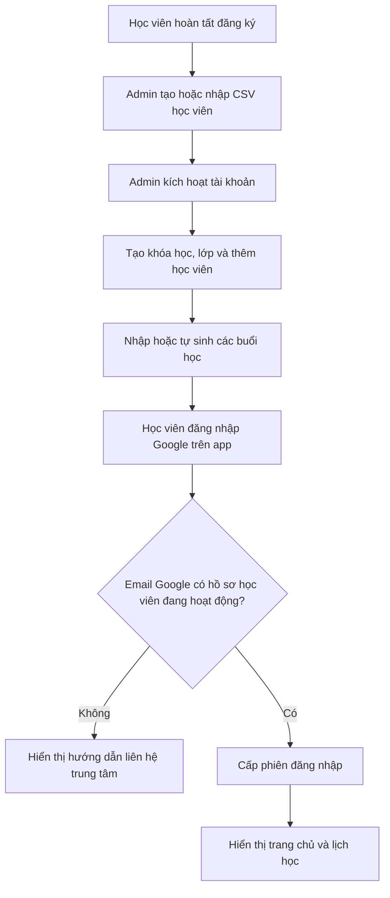
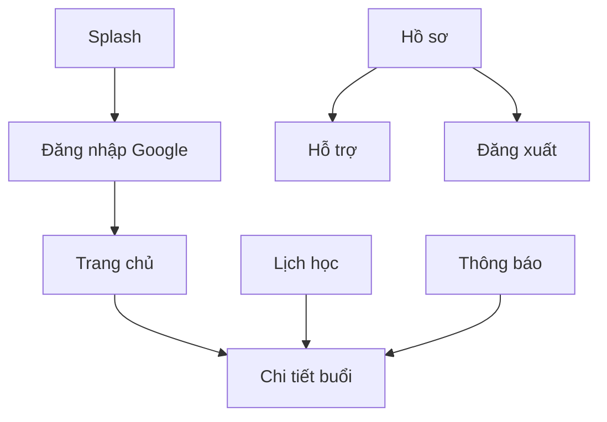

# Luồng nghiệp vụ và màn hình MVP

## 1. Luồng kích hoạt học viên độc lập

Trong MVP, admin nhập và quản lý danh sách học viên ngay trên hệ thống mới. Phần đồng bộ dữ liệu từ hệ thống khác sẽ làm sau.

## 2. Luồng đổi/hủy lịch

1. Admin mở một buổi học.
2. Chọn đổi lịch hoặc hủy.
3. Nhập thời gian mới nếu đổi và bắt buộc nhập lý do.
4. Backend cập nhật `Session` và tạo `Notification` cho lớp.
5. Push notification được gửi tới các thiết bị hợp lệ.
6. Học viên bấm thông báo để mở chi tiết buổi học.

## 3. Luồng tự sinh lịch hàng tuần

1. Admin tạo khóa học và nhập thời lượng theo số tuần.
2. Admin tạo lớp, chọn ngày bắt đầu và nhập một hoặc nhiều khung giờ hàng tuần.
3. Hệ thống sinh các buổi học đến hết thời lượng khóa học.
4. Admin kiểm tra danh sách buổi và có thể sửa riêng từng buổi.
5. Khi chạy lại chức năng sinh lịch, hệ thống bỏ qua buổi đã có và giữ các buổi đã sửa thủ công.

## 4. Điều hướng Android

Bottom navigation gồm bốn mục: **Trang chủ, Lịch học, Thông báo, Tài khoản**.

## 5. Màn hình Android bắt buộc

| Mã | Màn hình | Nội dung chính |
|---|---|---|
| M01 | Splash | Placeholder SVTC, kiểm tra phiên, chuyển tới đăng nhập hoặc trang chủ |
| M02 | Đăng nhập | Nút Google, điều khoản ngắn, lỗi email chưa kích hoạt |
| M03 | Trang chủ | Buổi gần nhất, lớp đang học, số thông báo chưa đọc |
| M04 | Lịch học | Danh sách ngày/tuần, lọc lớp, nhãn đổi/hủy |
| M05 | Chi tiết buổi | Thời gian, giảng viên, địa điểm/link, ghi chú, lý do thay đổi |
| M06 | Thông báo | Danh sách, chưa đọc, mở đúng nội dung |
| M07 | Tài khoản | Hồ sơ, cài đặt thông báo, hỗ trợ, đăng xuất |

MVP có 7 màn hình chính. Màn hình khóa học, tài liệu, bài tập, điểm danh và báo cáo sẽ làm sau MVP.

## 6. Trang admin thuộc phạm vi MVP

| Mã | Trang | Nội dung chính |
|---|---|---|
| A01 | Đăng nhập admin | Email/mật khẩu và thông báo lỗi |
| A02 | Học viên | Danh sách, tạo, sửa, kích hoạt, khóa, nhập CSV, tìm theo tên/email |
| A03 | Khóa học | Tạo/sửa khóa học và thời lượng đào tạo |
| A04 | Lớp | Tạo/sửa lớp, hình thức học, lịch tuần và thêm/bỏ học viên |
| A05 | Buổi học | Tự sinh lịch, nhập từng buổi, sửa/đổi/hủy buổi |
| A06 | Thông báo | Soạn và gửi thông báo theo lớp, xem trạng thái cơ bản |

## 7. Trạng thái UI bắt buộc

- Đang tải.
- Có dữ liệu.
- Không có dữ liệu.
- Lỗi mạng/server và nút thử lại.
- Phiên hết hạn hoặc bị khóa.
- Không có quyền truy cập.

App có thể giữ tạm dữ liệu gần nhất để giao diện tải nhanh hơn. Lịch trên backend vẫn là dữ liệu chính thức. Chức năng xem và đồng bộ lịch khi mất mạng sẽ làm sau MVP.
