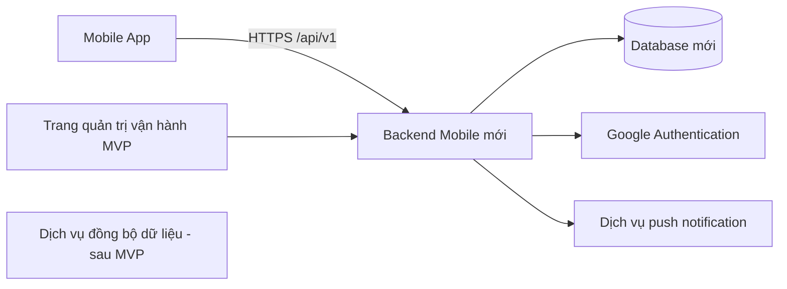

# Đặc tả kỹ thuật MVP

## 1. Nguyên tắc

- Đội phát triển tự chọn công nghệ cho ứng dụng Android, backend, trang admin, database, push notification, hosting và theo dõi lỗi.
- Google Authentication là yêu cầu bắt buộc cho đăng nhập học viên.
- Hệ thống dùng backend và cơ sở dữ liệu riêng.
- Nếu sử dụng HTTP API, API phải có phiên bản và tài liệu đầy đủ.
- Khi cần kết nối với hệ thống khác của SVTC, đội phát triển sẽ xây thêm phần đồng bộ riêng.
- Các dữ liệu chính có `externalId` để lưu mã tham chiếu từ hệ thống khác.

## 2. Yêu cầu khi chọn công nghệ

- Phù hợp với Android và tiến độ 8 tuần của dự án.
- Có tài liệu chính thức, còn được duy trì và không dùng thư viện đã ngừng hỗ trợ.
- Cho phép bàn giao đầy đủ source code và dựng lại trên máy/tài khoản khác.
- Không phụ thuộc vào tài khoản cá nhân sau khi source code được bàn giao.
- Có cách lưu secret an toàn, phân quyền dữ liệu, backup và theo dõi lỗi.
- Thư viện và dịch vụ sử dụng phải có giấy phép phù hợp.
- README phải ghi rõ công nghệ được chọn, phiên bản và lý do chọn.

Đội phát triển dùng tài khoản cá nhân để tạo database, máy chủ, dịch vụ push và các dịch vụ chạy thử. Source code không chứa secret hoặc thông tin đăng nhập. README phải hướng dẫn cách tạo lại toàn bộ môi trường trên tài khoản khác.

## 3. Kiến trúc độc lập

`FutureIntegration` minh họa phần đồng bộ dữ liệu sẽ được xây khi SVTC có yêu cầu kết nối hệ thống.

## 4. Dữ liệu tối thiểu

### Admin

- `email`, `passwordHash`, `fullName`, `status`, timestamps.

### SystemSetting

- `brandName`: mặc định `SVTC`.
- `logo`: dùng placeholder cho đến khi có logo chính thức.
- `centerName`, `centerAddress`, `hotline`, `supportEmail`.
- MVP lưu một địa chỉ cơ sở.

### Student

- `fullName`, `email` unique normalized, `phone`.
- `googleSubjectId` unique sparse.
- `status`: `inactive`, `active`, `blocked`.
- `externalId` dùng để lưu mã học viên từ hệ thống khác khi có kết nối dữ liệu.
- `notificationEnabled`, timestamps.

### Course

- `name`, `code`, `description`, `status`.
- `durationWeeks`: số nguyên dương, bắt buộc.

### Class

- `courseId`, `name`, `code`, `instructorName`.
- `startDate`, `endDate`.
- `weeklySchedule`: thứ trong tuần, giờ bắt đầu, giờ kết thúc và hình thức học.
- `defaultLocation`, `room`, `defaultMeetingUrl`.
- `status`: `active`, `completed`, `cancelled`.
- `externalId` dùng để lưu mã lớp từ hệ thống khác khi có kết nối dữ liệu.

### Enrollment

- `studentId`, `classId`, `status`: `active`, `cancelled`.
- Unique index `studentId + classId`.

### Session

- `classId`, `title`, `startAt`, `endAt`.
- `instructorName`, `location`, `meetingUrl`, `note`.
- `status`: `scheduled`, `rescheduled`, `cancelled`, `completed`.
- `previousStartAt`, `previousEndAt`, `changeReason`.
- `generatedFromSchedule`, `scheduleKey`, `manuallyEdited`.
- `externalId` dùng để lưu mã buổi học từ hệ thống khác khi có kết nối dữ liệu.

### Notification

- `classId`, `type`, `title`, `body`, `sessionId` tùy chọn.
- `scheduledAt`, `createdAt`, `sentAt`, `status`.
- `idempotencyKey`: khóa chống tạo/gửi trùng.

### NotificationRead

- `notificationId`, `studentId`, `readAt`.

### DeviceSession

- `studentId`, `deviceId`, `platform`, `pushToken`.
- `refreshTokenHash`, `expiresAt`, `revokedAt`.

## 5. Các nghiệp vụ dữ liệu cho Android

Danh sách endpoint dưới đây là hợp đồng tham khảo nếu đội phát triển chọn REST API. Đội có thể đổi tên endpoint hoặc chọn cách giao tiếp khác, nhưng phải cung cấp đủ các nghiệp vụ và tài liệu sử dụng tương ứng.

### Authentication

| Method | Endpoint | Mô tả |
|---|---|---|
| POST | `/api/v1/auth/google` | Xác minh Google token và cấp phiên |
| POST | `/api/v1/auth/refresh` | Làm mới phiên |
| POST | `/api/v1/auth/logout` | Thu hồi phiên hiện tại |

### Học viên

| Method | Endpoint | Mô tả |
|---|---|---|
| GET | `/api/v1/me` | Hồ sơ học viên |
| GET | `/api/v1/me/dashboard` | Buổi gần nhất, lớp và số thông báo |
| PATCH | `/api/v1/me/preferences` | Cài đặt thông báo |
| PUT | `/api/v1/me/devices/:deviceId` | Đăng ký push token |

### Lớp và lịch

| Method | Endpoint | Mô tả |
|---|---|---|
| GET | `/api/v1/me/classes` | Các lớp của học viên |
| GET | `/api/v1/me/sessions?from=&to=&classId=` | Lịch trong khoảng thời gian |
| GET | `/api/v1/me/sessions/:id` | Chi tiết buổi nếu học viên thuộc lớp |

### Thông báo

| Method | Endpoint | Mô tả |
|---|---|---|
| GET | `/api/v1/me/notifications?page=` | Danh sách thông báo |
| GET | `/api/v1/me/notifications/unread-count` | Số chưa đọc |
| PATCH | `/api/v1/me/notifications/:id/read` | Đánh dấu đã đọc |

Đội phát triển tự chọn cách trang admin giao tiếp với backend. Các giao diện công khai chỉ cung cấp những nghiệp vụ cần thiết và phải có kiểm tra quyền truy cập.

## 6. Quy tắc nhập CSV

- File dùng định dạng UTF-8 và có hàng tiêu đề.
- Các cột bắt buộc: `fullName`, `email`.
- Các cột tùy chọn: `phone`, `classCode`.
- Email được chuẩn hóa chữ thường và bỏ khoảng trắng thừa.
- Hệ thống kiểm tra email sai định dạng, email trùng trong file và email đã tồn tại.
- Học viên mới được tạo với trạng thái `inactive`.
- Email đã tồn tại được bỏ qua và ghi rõ trong kết quả; hệ thống không tự ghi đè dữ liệu cũ.
- Nếu có `classCode`, mã lớp phải tồn tại. Mã lớp sai làm dòng đó thất bại và không tạo dữ liệu một phần.
- Admin có thể kích hoạt từng học viên hoặc kích hoạt nhiều học viên sau khi xem kết quả nhập.
- Dòng hợp lệ vẫn được nhập khi một số dòng khác có lỗi.
- Sau khi xử lý, admin nhận tổng số dòng thành công, thất bại và lý do lỗi của từng dòng.

## 7. Quy tắc tự sinh lịch học

1. Admin tạo khóa học và nhập thời lượng theo số tuần.
2. Admin tạo lớp, chọn khóa học, ngày bắt đầu và các khung giờ lặp hàng tuần.
3. Hệ thống tính `classEndDate = startDate + durationWeeks * 7 ngày`.
4. Hệ thống sinh từng `Session` có thời gian bắt đầu từ `startDate` và nhỏ hơn `classEndDate`.
5. `scheduleKey` gồm `classId + date + startTime` để tránh tạo trùng.
6. Buổi đã sửa thủ công có `manuallyEdited = true` và được giữ nguyên khi sinh lại lịch.
7. Admin có thể thêm một buổi riêng ngoài lịch lặp, đổi lịch hoặc hủy từng buổi.
8. Mọi thay đổi thời gian sau khi lớp đã có học viên phải tạo thông báo.
9. Thời gian lưu theo UTC và hiển thị theo múi giờ `Asia/Ho_Chi_Minh`.

Quy tắc hình thức học:

- `onsite`: dùng địa chỉ cơ sở trong `SystemSetting` và phòng học của buổi.
- `online`: dùng `meetingUrl` của lớp hoặc của buổi.
- Mỗi buổi có thể ghi đè hình thức và thông tin mặc định của lớp.

## 8. Bảo mật bắt buộc

- Backend xác minh `iss`, `aud`, `exp`, `sub` và `email_verified` của Google token.
- Chỉ cấp quyền khi email có tài khoản học viên ở trạng thái `active`.
- Lần đăng nhập đầu liên kết `googleSubjectId` với Google `sub`; các lần sau phải khớp giá trị đã liên kết.
- Thao tác xóa liên kết Google của admin phải thu hồi toàn bộ refresh token của học viên.
- Access token ngắn hạn; refresh token lưu dạng hash trong database.
- Token trên Android lưu bằng Keystore hoặc secure storage tương đương.
- Mỗi truy vấn lớp, buổi và thông báo phải kiểm tra enrollment của học viên.
- HTTPS bắt buộc; secret chỉ nằm trong biến môi trường.
- Rate limit đăng nhập và validate toàn bộ request.
- Khi admin khóa học viên, thu hồi toàn bộ phiên của học viên đó.
- Mật khẩu admin phải được băm bằng thuật toán phù hợp; cookie/session admin phải có `HttpOnly`, `Secure` khi dùng HTTPS và chính sách `SameSite` phù hợp.
- Form thay đổi dữ liệu trên trang admin phải có cơ chế chống CSRF hoặc biện pháp tương đương theo công nghệ đã chọn.

## 9. Chuẩn bị cho việc kết nối hệ thống sau này

Đội phát triển cần thực hiện các yêu cầu sau ngay từ MVP:

- Nếu dùng HTTP API, phải có versioning.
- Có `externalId` cho Student, Class và Session.
- Không dùng email làm khóa chính.
- Tách logic nghiệp vụ khỏi controller.
- Bàn giao tài liệu API hoặc tài liệu giao tiếp dữ liệu theo công nghệ đã chọn.
- Khi cần đồng bộ, xây một integration service riêng. Hệ thống bên ngoài không được truy cập trực tiếp vào cơ sở dữ liệu mobile.

## 10. Cách tổ chức hệ thống

- Đội phát triển tự chọn kiến trúc và cách giao tiếp giữa Android, backend và trang admin.
- Logic nghiệp vụ phải tách khỏi giao diện và lớp truy cập dữ liệu để dễ kiểm thử, sửa đổi.
- Tác vụ nhắc lịch phải chạy tự động và có cơ chế tránh gửi trùng.
- Khi đổi lịch, tác vụ nhắc cũ phải bị hủy và tạo lại theo giờ mới. Khi hủy buổi, mọi tác vụ nhắc chưa gửi của buổi đó phải bị hủy.
- Hạ tầng chạy thử phải có backup và theo dõi lỗi cơ bản.
- Cấu trúc source code phải rõ ràng và được mô tả trong README.

## 11. Bàn giao qua GitHub

- Bàn giao bằng đường dẫn repository GitHub.
- Nhánh chính chứa đầy đủ source code ứng dụng Android, backend và trang admin.
- README đặt tại thư mục gốc của repository.
- Bàn giao `.env.example`; không đưa secret thật vào repository.
- README ghi rõ công nghệ, phiên bản runtime/SDK và các công cụ cần cài.
- README hướng dẫn cấu hình Google Authentication, dịch vụ push, database và máy chủ mới.
- README hướng dẫn chạy local, build APK/AAB, deploy backend, tạo admin đầu tiên và seed dữ liệu mẫu.
- README mô tả cấu trúc source code, biến môi trường, lệnh test, backup/restore và lỗi thường gặp.
- Repository có `.gitignore` phù hợp và không chứa secret, file cấu hình riêng tư hoặc dữ liệu học viên thật.
- Nếu repository private, cấp quyền truy cập cho tài khoản GitHub do SVTC cung cấp.
- Giữ quyền truy cập cho đến khi SVTC xác nhận đã clone repository thành công.
- Dùng placeholder SVTC và dữ liệu mẫu trong source.
- Tài khoản cá nhân, secret, database chạy thử và máy chủ chạy thử không thuộc nội dung bàn giao.
- Trước khi nghiệm thu, phải clone repository trên máy sạch và dựng hệ thống thành công chỉ bằng README và các file mẫu trong source.
